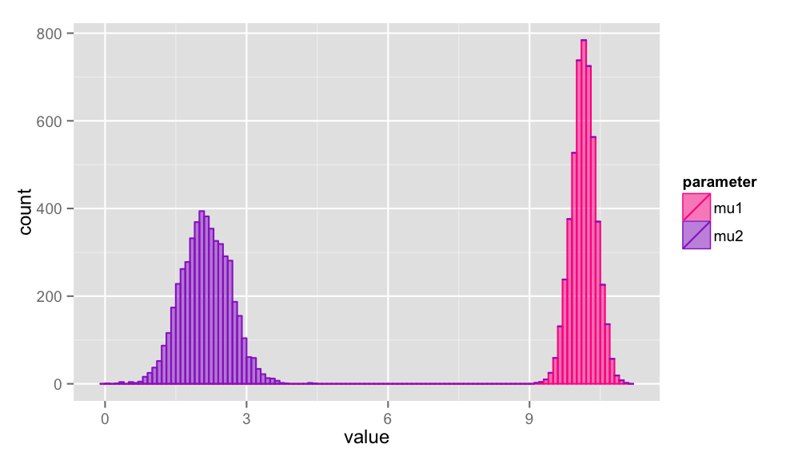
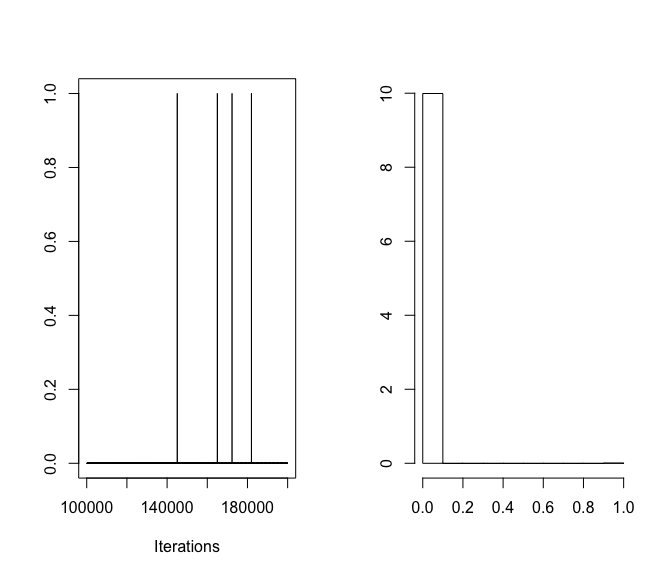
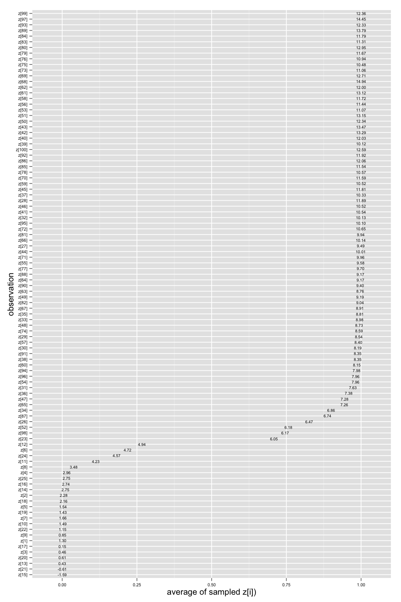
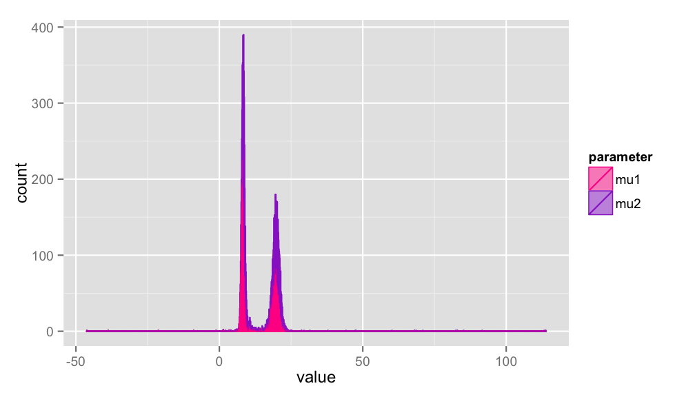
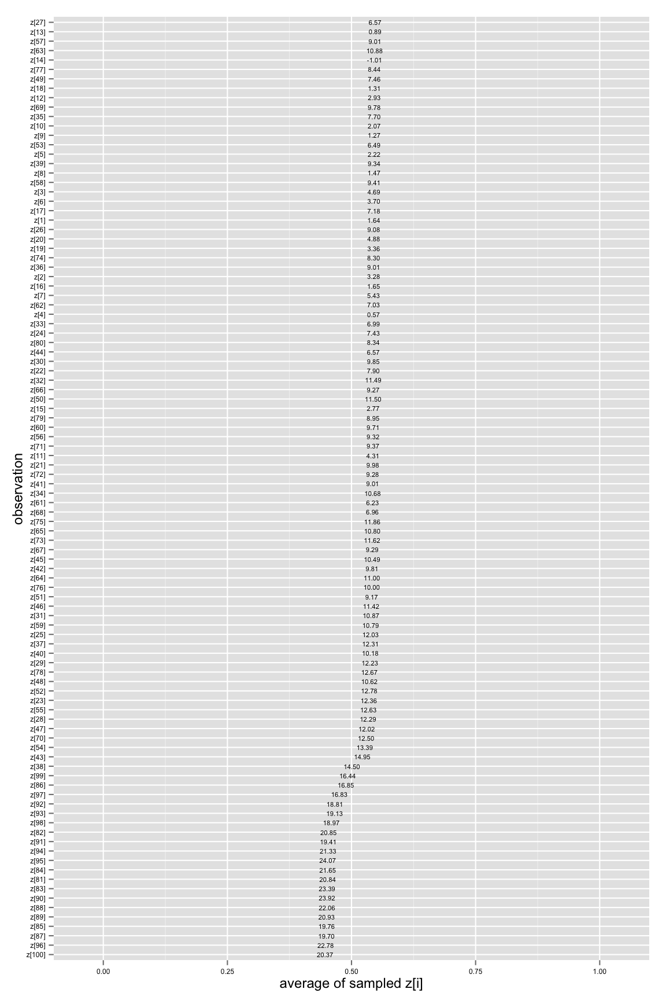

Two Component Mixture of Normals
================================


This short post describes how to model a two-component mixture of normal distrubutions using [JAGS](http://martynplummer.wordpress.com/jags/) via [R](http://cran.us.r-project.org/).  The exercise simulates data by pooling two normally-distributed random variables -- ```x1```, with a mean of 3 and standard deviation of 2; and ```x2```, with a mean of 10 and standard deviation of 2.  That last line of code puts the data into the list format that JAGS requires.  


```r
require(coda)
require(rjags)
require(reshape)
x1 <- rnorm(25, 3, 2)
x2 <- rnorm(75, 10, 2)
x <- c(x1,x2)
data <- list(x=x,n=length(x))
```


The JAGS code for a two-component mixture of normals is:

    model{
      p ~ dbeta(1,1)
      mu1 ~ dnorm(5, .01)
      mu2 ~ dnorm(5, .01)
      tau <- pow(sigma, -2)
      sigma ~ dunif(0,100)
      for (i in 1:n)
          {
          z[i] ~ dbern(p)
          mu[i] <- z[i]*mu1 + (1-z[i])*mu2
          x[i] ~ dnorm(mu[i], tau)
          }
    }

In most mixture models, we are interested in estimating are the (unknown) means of the two component distributions, ```mu1``` and ```mu2```.  Another feature of the model is that it returns values for each observation, ```z[i]```, at each sampled iteration, which can be averaged across the chain to produce an average probability that can be used for classification.  The average probability can be interpreted as the chance that a particular observation belongs to a particular component (i.e., distribution).  

We pass initial values to JAGS in order to initialize the MCMC simulation.  Each ```x[i]``` gets its own mean, ```mu[i]```, and these observations share a common variance equal to 1.


```r
init <- list(mu=array(rnorm(1*data$n)),mu1=rnorm(1), mu2=rnorm(1),sigma=1)
```


The model is passed to JAGS using R's ```textConnection()``` function (rather than creating a separate text file for the JAGS code).  The text is entered into ```R``` as the object ```modelstring```.  The MCMC simulation is run using the ```coda.samples()``` function in the **coda** package.  

Of particular interest is how well the model recovers the means of the two component distributions (```mu1``` = 3, and ```mu2``` = 10).  Figure 1 plots the simulated values for these parameters.  Despite the uninformative priors (of 10 and 50), the MCMC simulation recovers the true means quite well.


```r
model <- jags.model(textConnection(modelstring), data=data, n.adapt=1e5)
# Run samples using coda package sampler
out <- coda.samples(model=model, init=init, variable.names=c("mu1", "mu2", "z"), n.iter=1e5, thin=20)
# Extract elements from list: our estimates of the two means
mu1 <- unlist(out[,"mu1",])
mu2 <- unlist(out[,"mu2",])
```


**Figure 1.** Density estimation for the simulated values of ```mu1``` and ```mu2```


We can also assess the probability that the observations are drawn from one or the other component distribution.  The ```z[i]``` parameter is distributed Bernoulli, which means that at each iteration, each observation is assigned a 0 or 1.  In other words, at eatch iteration, the algorithm makes a judgment about whether the observation belongs to the ```mu1``` or the ```mu2``` distribution.  

Figure 2 presents this assignment variable for the ```z[1]``` parameter at each iteration (left panel) along with the density estimate (right panel).  When the value is close to one or the other true means, it is almost always be assigned either a 0 or a 1, so the average probability is close to 0 or 1.  When the observation's value is in between the two means, however, the samplers bounces back and forth, and the average probability comes closer to a coin flip.   

**Figure 2.** Traceplot and density estimate for the ```z[1]``` parameter

```r
plot(out[,"z[1]",])
```



The average for ```z[i]``` across the entire simulation represents the probability that an observation belongs to one or the other components.  Observations with a value that is close to one mean have sharper assignment probabilities -- that is, an average value that is close to either 0 or 1.  Figure 3 plots these average probabilities, where the numeric labels are the ```x[i]``` values.  Values that are close to the means are highly likely to have been drawn from one distribution or the other.  The model has difficulty assigning probabilities to those few observations that fall at roughly the midpoint between 3 and 10.


```r
z <- out[[1]][,grep("z", colnames(out[[1]]))]
zbar <- colMeans(z)
zbar <- melt(zbar)
probs <- data.frame(zbar = zbar, obs = rownames(zbar))
```


**Figure 3.** Each observation's probability of belonging to the ```mu1``` distribution

 

## Two component theoretical model but three data components

In the simulation, we knew ```x``` was a mixture of two random normal variables.  What happens when we attempt to use the two-component normal model to model data that is in fact a three-component mixture?  Let's find out by simulating some new data and re-running the JAGS model. 


```r
x1 <- rnorm(20, 3, 2)
x2 <- rnorm(60, 10, 2)
x3 <- rnorm(20, 20, 2)
x <- c(x1,x2,x3)
data <- list(x=x,n=length(x))
```


```r
# some new random values
init <- list(mu=array(rnorm(1*data$n)),mu1=rnorm(1), mu2=rnorm(1),sigma=1)
model <- jags.model(textConnection(modelstring), data=data, n.adapt=1e5)
# Run samples using coda package sampler
out <- coda.samples(model=model, init=init, variable.names=c("mu1", "mu2", "z"), n.iter=1e5, thin=20)
# Extract elements from list: our estimates of the two means
mu1 <- unlist(out[,"mu1",])
mu2 <- unlist(out[,"mu2",])
```


As is clear in Figure 4, few of the observations show separation -- that is, we do not know whether the observations are more likely to have come from the ```mu[1]``` or the ```mu[2]``` distribution.  

**Figure 4.** Density estimation for the simulated values of ```mu1``` and ```mu2```



The reason is illustrated in Figure 5.  The model's classification ability is poor because it needs to account for the third component.  One way to overcome this problem is to define a three-component normal mixture model explicitly.  This will be pursed in a future post.

**Figure 5.** Each observation's probability of belonging to the ```mu1``` distribution



